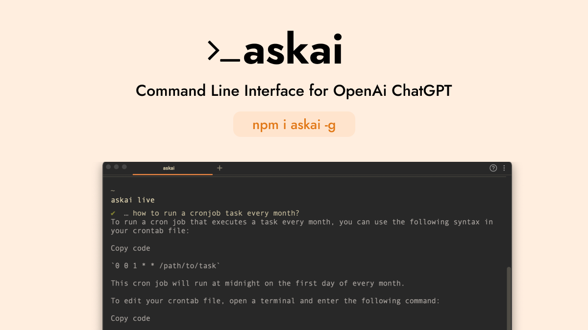

# askai

A command-line interface for OpenAI ChatGPT.

- 💬 Ask questions and chat with OpenAI ChatGPT
- 💻 Use from the command-line, no need for a web browser
- 💬 Live chat mode for real-time conversation with the model
- 🤖 Interact with the model using natural language

## Update ⚠️

On December 11, 2022, OpenAI implemented additional protections through Cloudflare to enhance security for the unofficial API. In order to use the API, you will need to obtain and use a valid OpenAI "session token" and Cloudflare "clearance token." It is recommended to refresh your Cloudflare cf_clearance token every hour or so, as these tokens expire after a period of two hours.

## Installation

To install `askai`, run the following command:

```
npm i askai -g
```

This will install the `askai` package globally on your system, allowing you to use it from any directory.

## Usage

To see a list of the available commands for `askai`, run the following command:

```
askai --help
```

This will display a list of the available commands, along with their usage instructions.

To use `askai`, you will need to login to your ChatGPT account. To do so, run the following command:

```
askai login
```

To log in to ChatGPT, you can follow these steps:

1. Open the ChatGPT website in your web browser.

2. Open the developer tools in your browser. You can do this by right-clicking on the page and selecting the "Inspect" or "Inspect Element" option.

3. In the developer tools, go to the "Application" or "Cookies" tab.

4. Find the cookie named \_\_Secure-next-auth.session-token.

5. Copy the value for cf_clearance and save it to your environment. This will be your clearanceToken.

6. Run the command `askai login` in your terminal or command prompt.

7. When prompted, paste the copied values into the input field.

After completing these steps, you should be logged in to ChatGPT.

To ask a question, run the following command:

```
askai <question>
```

This will send your question to ChatGPT, and the model will respond with an answer.

To start a live chat session, run the following command:

```
askai live
```

This will start a live chat session with ChatGPT. You can ask questions and the model will respond in real-time.

## How to contribute

Here are some ways you can contribute to `askai`:

- **Report bugs**: If you find a bug or issue with `askai`, please report it on the [issue tracker](https://github.com/yudax42/askai/issues). Be sure to include detailed instructions on how to reproduce the problem, as well as any error messages or log output.
- **Suggest new features**: Do you have an idea for a new feature or enhancement for `askai`? Please open an [issue](https://github.com/yudax42/askai/issues) to discuss it.
- **Write code**: If you are a developer, you can contribute directly to the `askai` codebase. To do so, please fork the [`askai` repository](https://github.com/yudax42/askai) on GitHub, make your changes, and then submit a pull request. Please be sure to include detailed documentation for your changes.
- **Improve the documentation**: Is something unclear or confusing in the `askai` documentation? Do you see any typos or mistakes? You can help improve the documentation by opening a pull request on the [`askai` repository](https://github.com/yudax42/askai) with your changes.

# Author

`askai` was created and is maintained by [Yudax](https://twitter.com/_yudax).

If you would like to support me, you can buy me a coffee on [Ko-Fi](https://ko-fi.com/yudax).

(This readme was auto generated by ChatGPT and askai - Yes I'm worried too)
